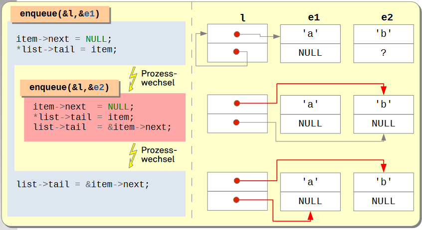

# Betriebssysteme (BS)

## 05. Synchronisation

### Wiederholung: Prozesse …

- sind Programme in Ausführung (unter BS-Kontrolle)
  - Die Abstraktion für Kontrollflüsse in Rechnersystemen
  - Konzeptionell unabhängig
  - Technisch findet ein Multiplexing der CPU statt.
  - Das Betriebssystem bestimmt den Zeitpunkt der Verdrängung und die Ausführungsreihenfolge der rechenbereiten Prozesse.
- haben einen Adressraum
  - Die logischen Adressen in einem Prozess werden durch die Hardware auf physische Speicheradressen abgebildet.
- können sich auch Code- und Datenbereiche teilen
  - Leicht- und federgewichtige Prozesse arbeiten im selben Adressraum.
  - Das Betriebssystem kann mit Hilfe der MMU auch einen Speicherbereich in mehrere Adressräume einblenden.
  - Die Daten des Betriebssystems werden ebenfalls (kontrolliert) geteilt.

### Inhalt

- Einführung und Begriffsbildung
- Ad-Hoc-Lösungsansätze
  - Aktives Warten - Busy Waiting
- Hardwareunterstützung
  - Unterbrechungssperre
  - Atomare Operationen
- Betriebssystemunterstützung
  - Semaphore
- Sprachunterstützung
  - Monitore
- Zusammenfassung

---

Tanenbaum  
2.3: Interprozesskommunikation  
2.4: Klassische Probleme der Interprozesskommunikation  
Silberschatz  
5: Synchronization

---

## Einführung und Begriffsbildung

### Beispiel: Einfache verkettete Liste in C

```c
/* Datentyp für Listenelemente */
struct element {
    char payload; /* eigentliche “Nutzlast” */
    struct element *next; /* Verkettungszeiger */
}

/* Datentyp für die Verwaltung von Listen */
struct list {
    struct element *head; /* erstes Element */
    struct element **tail; /* 'next' im letzten Element */
};

/* Funktion zum Anhängen eines neuen Elements */
void enqueue (struct list *list, struct element *item) {
    item->next = NULL;
    *list->tail = item;
    list->tail = &item->next;
}
```

Diese Listenimplementierung ist besonders raffiniert.  
Dadurch, dass tail nicht auf das letzte Element, sondern den next-Zeiger verweist, entfällt eine Sonderbehandlung für Einfügen in eine leere Liste.

### Beispiel: Einfache verkettete Liste in C

 \

### 1. Fall: Faden B nach Faden A

 \

### 2. Fall: Faden 2 überlappt Faden 1

 \

### Wo kommt das sonst noch vor?

- Gemeinsamer Speicher zur Kommunikation zwischen Prozessen
  - Systeme mit Shared Memory-Dienst
- Leicht- oder federgewichtige Prozesse
  - Nebenläufiger Zugriff auf dieselben Variablen
- Betriebssystemdaten, die gebraucht werden, um den Zugriff von Prozessen auf unteilbare Betriebsmittel zu koordinieren
  - Dateisystemstrukturen, Prozesstabelle, Speicherverwaltung …
  - Geräte (Terminal, Drucker, Netzwerkschnittstellen, …)
- Ähnlicher Sonderfall: Unterbrechungssynchronisation
  - Vorsicht: Verfahren, die sich für die Synchronisation von Prozessen eignen, funktionieren nicht notwendigerweise bei Unterbrechungen!

### Begriff: Race Condition

(oder auch **Wettlaufsituation**)

- Eine _Race Condition_ ist eine Situation, in der mehrere Prozesse
  konkurrierend auf gemeinsame Daten zugreifen und mindestens
  einer diese manipuliert. Der letztendliche Wert der gemeinsamen
  Daten hängt bei einer Race Condition davon ab, in welcher
  Reihenfolge die Prozesse darauf zugreifen. Das Ergebnis ist also
  nicht vorhersagbar und **kann** im Fall von überlappenden Zugriffen
  sogar **inkorrekt** sein!
- Um Race Conditions zu vermeiden, müssen konkurrierende
  Prozesse _synchronisiert_ werden.

### Begriff: Synchronisation

Die Koordination der Kooperation und Konkurrenz zwischen
Prozessen wird Synchronisation (synchronization) genannt.

- Eine Synchronisation bringt die Aktivitäten verschiedener
  nebenläufiger Prozesse in eine Reihenfolge.
- Durch sie erreicht man also prozessübergreifend das,
  wofür innerhalb eines Prozesses die Sequentialität von
  Aktivitäten sorgt.

---

Quelle: Herrtwich/Hommel (1989), Kooperation und Konkurrenz, S. 26

---

### Begriff: Kritischer Abschnitt

- Im Fall von Race Conditions streiten sich N Prozesse um den Zugriff auf
  gemeinsame Daten. Die Code-Fragmente, in denen auf diese kritischen
  Daten zugegriffen wird, werden kritische Abschnitte genannt.

**Problem**

- Es muss sichergestellt werden, dass sich immer nur ein Prozess in
  einem kritischen Abschnitt aufhalten kann.

### Lösungsansatz: Schlossvariablen

Eine Schlossvariable ist ein abstrakter Datentyp
mit 2 Operationen: acquire() und release()

```c
Lock lock; /* Eine globale Schlossvariable */
/* Beispielcode: enqueue */
void enqueue (struct list *list, struct element *item) {
    item->next = NULL;

    # • verzögert einen Prozess bis
    # das zugehörige Schloss offen ist
    # • verschließt das Schloss dann
    # von innen
    acquire (&lock);

    *list->tail = item;
    list->tail = &item->next;

    # öffnet das zugehörige Schloss,
    # ohne den aufrufenden Prozess
    # zu verzögern
    release (&lock);
}
```

Derartige Implementierungen werden als Schlossalgorithmen bezeichnet.

## Ad-Hoc-Lösungsansätze

#### - Aktives Warten - Busy Waiting

### Naiver Lösungsansatz

**FALSCH**

```c
/* Schlossvariable (Initialwert 0) */
typedef unsigned char Lock;
/* Kritischen Abschnitt betreten */
void acquire (Lock *lock) {
    while (*lock)
    ; /* Schleifenrumpf leer! */
    *lock = 1;
}
/* Kritischen Abschnitt wieder verlassen */
void release (Lock *lock) {
    *lock = 0;
}
```

### Naiver Lösungsansatz: Ein Henne-Ei-Problem!

```c
/* Schlossvariable */
typedef unsigned char Lock;
/* K.A. betreten */
void acquire (Lock *lock) {
   while (*lock);
   *lock = 1;
}
/* K.A. verlassen */
void release (Lock *lock) {
    *lock = 0;
}
```

- acquire() soll einen kritischen Abschnitt schützen, ist dabei aber selbst kritisch!
  - Problematisch ist der Moment nach dem Verlassen der Warteschleife und vor dem Setzen der Schlossvariablen.
  - Bei Verdrängung des laufenden Prozesses in diesem Moment könnte ein anderer Prozess den kritischen Abschnitt frei vorfinden und ebenfalls betreten.

```
Im weiteren Verlauf könnten (mindestens) zwei Prozesse
den eigentlich durch acquire() geschützten kritischen
Abschnitt überlappt ausführen!
```

### So geht’s: der „Bäckerei-Algorithmus“

(naja, in deutschen Bäckereien ist das eher unüblich)

- Bevor ein Prozess den kritischen Abschnitt betreten darf, bekommt er eine Wartenummer.
- Die Zulassung erfolgt in der Reihenfolge der Nummern, d.h. wenn der kritische Abschnitt frei ist, darf der Prozess mit der niedrigsten Nummer den kritischen Abschnitt betreten.
  - Beim Verlassen des kritischen Abschnitts verfällt seine Wartenummer.

Problem:

- Der Algorithmus kann nicht garantieren, dass eine Wartenummer nur an einen Prozess vergeben wird.
  - In diesem Fall entscheidet eine Prozess-ID (0..N-1) die Priorität.

### So geht’s: der „Bäckerei-Algorithmus“

Achtung: **Pseudo-Code**

```c
typedef struct { /* Schlossvariable (initial alles 0) */
   bool choosing[N];
   int number[N];
} Lock;
void acquire (Lock *lock) { /* K.A. betreten */
   int j; int i = pid();

   lock->choosing[i] = true;
   lock->number[i] = max(lock->number[0], ...number[N-1]) + 1;
   lock->choosing[i] = false;

   for (j = 0; j < N; j++) {
      while (lock->choosing[j]);
      while (lock->number[j] != 0 &&
      (lock->number[j] < lock->number[i] ||
      (lock->number[j] == lock->number[i] && j < i)));
   }
}
void release (Lock *lock) { /* K.A. verlassen */
   int i = pid(); lock->number[i] = 0;
}
```

### Diskussion: Bäckerei-Algorithmus

Der Algorithmus ist ein nachweisbar korrekte Lösung für das Problem der kritischen Abschnitte, aber …

- In der Regel weiß man vorab nicht, wieviele Prozesse um den Eintritt in einen kritischen Abschnitt konkurrieren werden.
- Prozess-IDs liegen nicht im Wertebereich von 0 bis N-1.
- die Funktion acquire() hat eine große Laufzeit, auch wenn der kritische Abschnitt frei ist. → O(N)

```
Wünschenswert wäre ein korrekter Algorithmus, der gleichzeitig so einfach wie der naive Ansatz ist!
```

## Hardwareunterstützung

### Unterbrechungen unterdrücken

- Nur durch den Unterbrechungsmechanismus der CPU kann es dazu
  kommen, dass einem Prozess innerhalb eines kritischen Abschnitts
  die CPU entzogen wird.

```c
/* K.A. betreten */
void acquire (Lock *lock) {
   asm ("cli");
}
/* K.A. verlassen */
void release (Lock *lock) {
   asm ("sti");
}
```

```
cli und sti werden bei Intel-x86-Prozessoren zum Sperren und
Erlauben von Unterbrechungen verwendet.
```

- Durch diese Lösung werden alle Prozesse und das Betriebssystem selbst (Gerätetreiber) beeinträchtigt.
  - sti und cli dürfen daher nicht im User-Mode benutzt werden.

### Schloss mit atomaren Operationen

Viele CPUs unterstützen unteilbare (atomare) Lese-/Modifikations-/Schreibzyklen, mit denen sich Schlossalgorithmen implementieren lassen:

- Motorola 68K: TAS (Test-and-Set)

  - Setzt Bit 7 des Zieloperanden und liefert den vorherigen Zustand in Condition Code Bits  
    

- Intel x86: XCHG (Exchange)
  - Tauscht den Inhalt eines Registers mit dem einer Variablen im Speicher  
    
- PowerPC: LL/SC (Load Linked/Store Conditional)
- …

### Diskussion: Aktives Warten

Unzulänglichkeit der bisher gezeigten Schlossalgorithmen:
Der aktiv wartende Prozess …

- kann selbst keine Änderung der Bedingung herbeiführen, auf die er wartet
- behindert daher unnütz Prozesse, die sinnvolle Arbeit leisten könnten
- schadet damit letztlich auch sich selbst:
  - Je länger der Prozess den Prozessor für sich behält, umso länger muss er darauf warten, dass andere Prozesse die Bedingung erfüllen, auf die er selbst wartet.
  - Nur bei Multiprozessorsystemen tritt dieses Problem nicht auf.

## Betriebssystemunterstützung

### Passives Warten als effizientere Alternative

- Prozesse geben die Kontrolle über die CPU ab,
  während sie auf Ereignisse warten
  - im Konfliktfall blockiert sich ein Prozess auf ein Ereignis  
    = PCB des Prozesses in eine Warteschlange eingereiht
  - tritt das Ereignis ein, wird ein darauf wartender Prozess deblockiert
- Die Wartephase eines Prozesses ist als Blockadephase
  („E/A-Stoß“) ausgelegt:
- der Ablaufplan für die Prozesse wird aktualisiert (scheduling)
- ein anderer, lauffähiger Prozess wird plangemäß abgefertigt (dispatching)
- ist kein Prozess mehr lauffähig, läuft die CPU „leer“ (idle phase)
- Mit Beginn der Blockadephase endet der CPU-Stoß des Prozesses.

### Semaphor (semaphore)

- Eine „nicht-negative ganze Zahl“, für die zwei unteilbare Operationen definiert sind:

  **P** (niederländisch prolaag, „erniedrige“; auch down, wait)

  - hat der Semaphor den Wert 0, wird der laufende Prozess blockiert
  - ansonsten wird der Semaphor um 1 dekrementiert

  **V** (niederländisch verhoog, „erhöhe“; auch up, signal)

  - auf den Semaphor ggf. blockierter Prozess wird deblockiert
  - ansonsten wird der Semaphor um 1 inkrementiert

- Eine _Betriebssystemabstraktion_ zum Austausch von Synchronisationssignalen zwischen nebenläufig arbeitenden Prozessen.

### Semaphor (semaphore) - Implementierung

```c
/* Implementierung aus OO-StuBS */
class Semaphore : public WaitingRoom {
   int counter;
public:
   Semaphore(int c) : counter(c) {}
   void wait() {
   if (counter == 0) {
      Customer *life = (Customer*)scheduler.active();
      enqueue(life);
      scheduler.block(life, this);
   }
   else
      counter--;
   }
   void signal() {
      Customer *customer = (Customer*)dequeue();
      if (customer)
         scheduler.wakeup(customer);
      else
         counter++;
} };
```

```
Ein WaitingRoom ist eine Liste von PCBs mit den Zugriffsmethoden enqueue und dequeue
```

Der Scheduler muss drei Operationen zur Verfügung stellen:

- active liefert PCB des laufenden Prozesses
- block versetzt einen Prozess in den Zustand BLOCKED.
- wakeup setzt einen blockierten Prozess wieder auf die Bereit-Liste

### Semaphor - Anwendung

Gegenseitiger Ausschluss: Ein mit 1 initialisierter Semaphor kann als Schlossvariable fungieren.

```c
Semaphore lock; /* = 1; Semaphor als Schlossvariable */
/* Beispielcode: euqueue */
void enqueue (struct list *list, struct element *item) {
   item->next = NULL;
   # der erste Prozess, der den
   # kritischen Abschnitt betritt
   # erniedrigt den Zähler auf 0
   # alle weiteren blockieren
   wait (&lock);
   *list->tail = item;
   list->tail = &item->next;
   # beim Verlassen wird entweder
   # ein blockierter Prozess geweckt
   # oder der Zähler wieder auf 1
   # erhöht
   signal (&lock);
}

   #... und das ist nicht die einzige Anwendung
```

### Semaphor - einfache Interaktionen

- Einseitige Synchronisation

```c
/* gem. Speicher */
Semaphore elem;
struct list l;
struct element e;
```

```c
void producer() {
enqueue(&l, &e);
signal(&elem);
}
```

```c
void consumer() {
struct element *x;
wait(&elem);
x = dequeue(&l);
}
```

```c
/* Initialisierung */
elem = 0;
```

- Betriebsmittelorientierte Synchronisation

```c
/* gem. Speicher */
Semaphore resource;
```

```c
/* Initialisierung */
resource = N; /* N > 1 */
```

sonst wie beim gegenseitigen Ausschluss

### Semaphor - komplexe(re) Interaktionen

- Beispiel: Das erste Leser/Schreiber-Problem

```
Wie beim gegenseitigen Ausschluss soll auch in diesem Beispiel ein kritischer Abschnitt geschützt werden.
Es gibt allerdings zweiKlassen von konkurrierenden Prozessen:
• Schreiber: Sie ändern Daten und müssen daher gegenseitigen Ausschluss garantiert bekommen.
• Leser: Da sie nur lesen, dürfen mehrere Leser auch gleichzeitig den kritischen Abschnitt betreten.
```

### Semaphor - komplexe(re) Interaktionen

- Beispiel: Das erste Leser/Schreiber-Problem

```c
/* gem. Speicher */
Semaphore mutex;
Semaphore wrt;
int readcount;
```

```c
/* Initialisierung */
mutex = 1;
wrt = 1;
readcount = 0;
```

```c
/* Schreiber */
wait (&wrt);
... schreibe
signal (&wrt);
```

```c
/* Leser */
wait(&mutex);
readcount++;
if (readcount == 1)
   wait(&wrt);
signal(&mutex);
... lese
wait(&mutex);
readcount--;
if (readcount == 0)
   signal(&wrt);
signal(&mutex):
```

### Semaphore - Diskussion

- Erweiterungen/Varianten
  - Binäre Semaphore oder Mutex
  - nicht-blockierendes wait()
  - Timeout
  - Felder von Zählern
- Fehlerquellen
  - Gefahr von Verklemmungen → nächste Vorlesung
  - Komplexere Synchronisationsmuster schwierig
  - Abhängigkeit kooperierender Prozesse
    - jeder muss die Protokolle exakt einhalten
  - Semaphorbenutzung wird nicht erzwungen

➔ Unterstützung durch die Programmiersprache

## Sprachunterstützung

### Monitor (Hoare 1974, Hansen 1975)

- Ein abstrakter Datentyp mit impliziten Synchronisationseigenschaften:

1. mehrseitige Synchronisation an der Schnittstelle zum Monitor
   - gegenseitiger Ausschluss der Ausführung aller Methoden
2. einseitige Synchronisation innerhalb des Monitors mit Hilfe von
   Bedingungsvariablen (condition variables)
   - wait blockiert einen Prozess auf das Eintreten eines Signals/einer Bedingung und gibt den Monitor implizit wieder frei
   - signal zeigt das Eintreten eines Signals/einer Bedingung an und deblockiert ggf. (genau einen oder alle) darauf blockierte Prozesse

- Sprachgestützter Mechanismus:
  Concurrent Pascal, PL/I, CHILL, . . . , Java.

### Monitor - Beispielcode

**Achtung: _Pseudo-Code_**

```c
/* Eine synchronisierte Warteschlange */
/* Pro SyncQueue-Objekt
   garantiert die Sprache
   gegenseitigen Ausschluss
   der Zugriffsmethoden. */
monitor SyncQueue {
   Queue queue;
   condition not_empty;

public:
   /* Element einhängen */
   /* enqueue signalisiert, dass
      die Queue nicht mehr
      leer ist. Wenn kein Prozess
      wartet, passiert nichts. */
   void enqueue(Element element) {
      queue.enqueue(element);
      not_empty.signal();
   }
   /* Element aushängen */
   /* dequeue wartet zunächst
      darauf, dass mindestens ein
      Element in der Queue ist. */
   Element dequeue() {
      while (queue.is_empty())
         not_empty.wait();
      return queue.dequeue();
   }
}
```

### Monitor - Signalisierungssemantik

- Im Falle wartender Prozesse sind als Anforderungen zwingend zu erfüllen:
  - Wenigstens ein Prozess deblockiert an der Bedingungsvariablen und
  - höchstens ein Prozess rechnet nach der Operation im Monitor weiter
- Es gibt verschiedene Lösungsvarianten, jeweils mit unterschiedlicher Semantik
  - Anzahl der befreiten Prozesse (d.h., alle oder nur einer)
    - Wenn nur einer, dann welcher?  
       Konflikte mit der CPU-Zuteilungsstrategie sind möglich.
  - Besitzwechsel des Monitors, kein Besitzwechsel (Besitzwahrung)
    - Wenn kein sofortiger Besitzwechsel erfolgt, muss die Wartebedingung erneut überprüft werden.

### Monitor - in Java

- Schlüsselwort _synchronized_ für gegenseitigen Ausschluss
- **Eine** implizite Bedingungsvariable
  - _notify_ oder _notifyAll_ statt **signal**, kein Besitzwechsel

```java
/* Eine synchronisierte Warteschlange */
class SyncQueue {
   private Queue queue;
   /* Element einhängen */
   public synchronized void enqueue(Element element) {
      queue.enqueue(element);
      notifyAll();
   }
   /* Element aushängen */
   public synchronized Element dequeue() {
      while (queue.empty()) wait();
      return queue.dequeue();
   }
};
```

## Zusammenfassung

- Unkontrollierte nebenläufige Zugriffe führen zu Fehlern
  - Synchronisationsverfahren sorgen für Koordination
  - Grundsätzlich muss man bei der Implementierung aufpassen, dass die Auswahlstrategien nicht im Widerspruch zum Scheduler stehen.
- Ad-hoc-Verfahren: Aktives Warten
  - Vorsicht! Verschwendung von Rechenzeit
  - Aber: kurz aktiv Warten ist besser als Blockieren, insbesondere in Multiprozessorsystemen → Multiprozessor-VL
- Betriebssystemunterstützte Verfahren: Semaphore
  - Flexibel (erlaubt viele Synchronisationsmuster), aber fehlerträchtig
- Sprachunterstützte Verfahren: Monitore
  - Weniger vielseitig als Semaphore
  - Teuer durch viele Kontextwechsel
  - Dafür aber sicher
