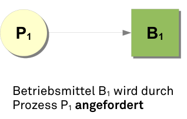
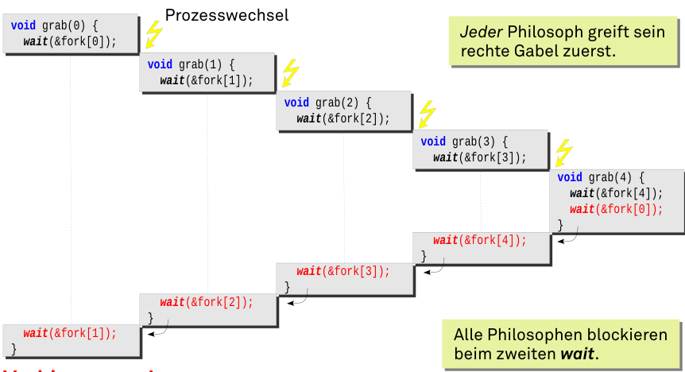

# Betriebssysteme (BS)

## 06. Verklemmungen

### Wiederholung

- Prozesse in einem Rechner arbeiten nebenläufig
- Zur Koordination von Prozessen werden Synchronisationsprimitiven
  eingesetzt
- Grundidee ist das passive Warten
- Der Semaphor erlaubt …
  - gegenseitigen Ausschluss
  - einseitige Synchronisation
  - betriebsmittelorientierte Synchronisation
- Wartemechanismen führen zu Verklemmungsproblemen

### Inhalt

- Ursachenforschung
- Verklemmungen von Prozessen
  - Konsumierbare und nicht-konsumierbare Betriebsmittel
  - Modellierung durch Betriebsmittelbelegungsgraphen
- Ein klassisches Verklemmungsproblem
  - „Die fünf Philosophen“
- Gegenmaßnahmen, Verklemmungsbekämpfung
  - Vorbeugung
  - Vermeidung
  - Erkennung und Auflösung
- Zusammenfassung

```
Tanenbaum
6: Deadlocks
Silberschatz
5: Deadlocks
```

### Verklemmung auf der Straße

 /

### Ursachenforschung … am Beispiel

 /

### Ursachenforschung … abstrakt

 /

### Ursachenforschung … abstrakt

 /

### Verklemmungen von Prozessen

- Der Begriff bezeichnet (in der Informatik)

```
„[ . . . ] einen Zustand, in dem die beteiligten Prozesse
wechselseitig auf den Eintritt von Bedingungen warten, die nur
durch andere Prozesse in dieser Gruppe selbst hergestellt werden
können.“
Jürgen Nehmer und Peter Sturm. Systemsoftware: Grundlagen moderner Betriebssysteme. dpunkt.Verlag GmbH, zweite Ausgabe, 2001.
```

### Verklemmung von Prozessen

1. Variante: Deadlock
   - Passives Warten
   - Prozesszustand: _BLOCKED_
2. Variante: Livelock
   - Aktives Warten (busy waiting oder „lazy“ busy waiting)
   - Prozesszustand beliebig (auch _RUNNING_), aber kein Fortschritt

- Deadlocks sind das vergleichsweise **geringere Übel**:
  - Zustand eindeutig erkennbar → Basis zur „Auflösung“ gegeben
  - Extrem hohe Systembelastung durch aktives Warten

### Bedingungen für eine Verklemmung

Damit es zu einer Verklemmung kommen _kann_, müssen _alle_ folgenden
**notwendigen Bedingungen** erfüllt sein:

1. Exklusive Belegung von Betriebsmitteln (**mutual exclusion**)
   - die umstrittenen Betriebsmittel sind nur unteilbar nutzbar
2. Nachforderung von Betriebsmitteln (**hold and wait**)
   - die umstrittenen Betriebsmittel sind nur schrittweise belegbar
3. Kein Entzug von Betriebsmitteln (**no preemption**) - die umstrittenen Betriebsmittel sind nicht rückforderbar
   Erst wenn zur Laufzeit die **hinreichende Bedingung** eintritt,
   liegt tatsächlich eine Verklemmung vor:
4. Zirkuläres Warten (**circular wait**)
   - Eine geschlossene Kette wechselseitig wartender Prozesse

### Betriebsmittel ...

werden vom Betriebssystem verwaltet und den Prozessen zugänglich
gemacht. Man unterscheidet zwei Arten:

- Wiederverwendbare Betriebsmittel - Werden von Prozessen für eine bestimmte Zeit belegt und anschließend wieder
  freigegeben. - _Beispiele_: CPU, Haupt- und Hintergrundspeicher, E/A-Geräte, Systemdatenstrukturen wie Dateien, Prozesstabelleneinträge, … - Typische Zugriffssynchronisation: _Gegenseitiger Ausschluss_
- Konsumierbare Betriebsmittel
  - Werden im laufenden System erzeugt (produziert) und zerstört (konsumiert)
  - _Beispiele_: Unterbrechungsanforderungen, Signale, Nachrichten, Daten von Eingabegeräten
  - Typische Zugriffssynchronisation: _Einseitige Synchronisation_

Wiederverwendbare Betriebsmittel

- Es kommt zu einer Verklemmung, wenn zwei Prozesse ein wiederverwendbares Betriebsmittel belegt haben, das vom jeweils anderen nachgefordert wird.
- Beispiel: Ein Rechnersystem hat 200 GByte Hauptspeicher. Zwei Prozesse belegen den Speicher schrittweise. Die Belegung erfolgt blockierend.

 \
 \

```
Wenn beide Prozesse ihre erste Anforderung ausführen, bevor Speicher nachgefordert wird, ist eine Verklemmung unvermeidbar.
```

### Konsumierbare Betriebsmittel

- Es kommt zu einer Verklemmung, wenn zwei Prozesse auf ein
  konsumierbares Betriebsmittel warten, das vom jeweils anderen
  produziert wird.
- Beispiel: Synchronisationssignale werden mit Hilfe der Semaphor-
  operation wait und signal zwischen zwei Prozessen „verschickt“.

 \

```
Jeder Prozess wartet auf ein Synchronisationssignal des anderen,
das dieser aber nicht senden kann, da er selbst blockiert ist.
```

### Betriebsmittelbelegungsgraphen

(engl. resource allocation graphs)

- … werden benutzt, um Verklemmungssituationen zu visualisieren und auch automatisch zu erkennen.
  - Beschreiben einen aktuellen Systemzustand
  - Knoten: Prozesse und Betriebsmittel
  - Kanten: zeigen Anforderung oder Belegung an

 \

 \

### Betriebsmittelbelegungsgraphen

- Frage: Liegt zirkuläres Warten vor? Wer ist beteiligt? (Prozesse A-B, Betriebsmittel R-W)

 \

 \

## Ein klassisches Verklemmungsproblem

### Die fünf speisenden Philosophen

 \

Prozess → Philosoph
Betriebsmittel → Gabel (unteilbar)

```
Fünf Philosophen, die nichts anderes zu tun haben, als zu denken und zu essen, sitzen an einem runden Tisch.

Denken macht hungrig — also wird jeder Philosoph auch essen.

Dazu benötigt ein Philosoph jedoch stets beide neben seinem Teller liegenden Gabeln.
```

### Verklemmte Philosophen?

Die drei ersten notwendigen Bedingungen sind erfüllt:

- _mutual exclusion_
  - Aus hygienischen Gründen dürfen die Philosophen sich keine Gabeln teilen.
- _hold and wait_
  - Die Philosophen hängen vor dem Essen noch so sehr ihren Gedanken nach, dass sie weder echt gleichzeitig die Gabeln greifen können, noch auf die Idee kommen, eine Gabel wieder wegzulegen.
- _no preemption_
  - Einem anderen Philosophen die Gabel zu entreißen, kommt selbstverständlich nicht in Frage.

Aber kommt es wirklich zu einer Verklemmung?

### Speisende Philosophen: Version 1

```c
/* nebenläufig für alle ... */
void phil (int who) {
    while (1) {
        think();
        grab(who);
        eat();
        drop(who);
    }
}

void think () { ... }
void eat () { ... }
```

```c
semaphore fork[NPHIL] = {
    {1, NULL}, ...
};
void grab (int who) {
    wait(&fork[who]);
    wait(&fork[(who+1)%NPHIL]);
}
void drop (int who) {
    signal(&fork[who]);
    signal(&fork[(who+1)%NPHIL]);
}
```

```
Mit Hilfe eines Semaphors wird gegenseitiger Ausschluss beim Zugriff
auf die Gabeln garantiert.
Jeder Philosoph nimmt erst sein rechte und dann seine linke Gabel.
```

### ... leider verklemmungsgefährdet

 \

_Verklemmung!_

 \

### Speisende Philosophen: Version 2

```c
semaphore mutex = {1, NULL};
void grab (int who) {
    wait(&mutex);
    wait(&fork[who]);
    wait(&fork[(who+1)%NPHIL]);
    signal(&mutex);
}
```

```
Das Problem von Version 1 waren Prozesswechsel zwischen dem 1. und 2. wait – ein kritischer Abschnitt. Version 2 schützt diesen kritischen Abschnitt durch gegenseitigen Ausschluss.
```

- Verklemmungsfreiheit? Ja, ...
  - Max. 1 Prozess kann auf eine Gabel warten (Zyklus braucht 2!)
  - Ein Prozess, der auf mutex wartet, hat keine Gabel
- Eine „gute Lösung“? Nein, ...
  - Wenn philowho isst, blockiert philowho+1 im kritischen Abschnitt. Alle weiteren blockieren dann auch. Viele Spagetti werden kalt.
  - **Geringe Nebenläufigkeit** und **schlechte Ressourcennutzung**

### Speisende Philosophen: Version 3

```c
const int N = 5; /* Anzahl der Philosophen */
semaphore mutex = {1, NULL}; /* Gegens. Ausschluss */
semaphore s[N] = {{0, NULL},...}; /* ein Semaphor pro Philosoph */
enum { THINKING, EATING, HUNGRY } status[N]; /* Philo.-Zustand */

int left(i) { return (i+N-1)%N; } /* Index linker Nachbar */
int right(i) { return (i+1)%N; } /* Index rechter Nachbar */
```

```c
void test (int i) {
    if (status[i] == HUNGRY && status[left(i)] != EATING &&
    status[right(i)] != EATING) {
        status[i] = EATING;
        signal(&s[i]);
    }
}
```

```c
void grab (int i) {
    wait(&mutex);
    status[i] = HUNGRY;
    test(i);
    signal(&mutex);
    wait(&s[i]);
}
```

```c
void drop (int i) {
    wait(&mutex);
    status[i] = THINKING;
    test(left(i));
    test(right(i));
    signal(&mutex);
}
```

```
Diese Lösung ist verklemmungsfrei und hat den maximalen Grad an Nebenläufigkeit.
```

### Diskussion: Speisende Philosophen

- Im Speziellen: Es gibt meist viele Möglichkeiten für Verklemmungsfreiheit zu sorgen

  - Lösungen unterscheiden sich im Grad der möglichen Nebenläufigkeit
  - Bei einer zu restriktiven Lösung liegen Betriebsmittel zeitweilig unnötig brach.

- Im Allgemeinen: Repräsentatives Beispiel für
  Verklemmungsprobleme bei der Verwaltung unteilbarer
  Betriebsmittel - Geht auf E. Dijkstra zurück (1965) - Etabliertes Standardszenario für die Bewertung und Illustration von
  Betriebssystem- und Sprachmechanismen zur nebenläufigen Programmierung

## Gegenmaßnahmen, Verklemmungsbekämpfung

### Verklemmungsvorbeugung

(engl. deadlock prevention)

- indirekte Methoden entkräften eine der Bedingungen 1–3  
   1 nicht-blockierende Verfahren verwenden  
   2 Betriebsmittelanforderungen unteilbar (atomar) auslegen  
   3 Betriebsmittelentzug durch Virtualisierung ermöglichen
  - virtueller Speicher, virtuelle Geräte, virtuelle Prozessoren
- direkte Methoden entkräften Bedingung 4  
   4 lineare/totale Ordnung von Betriebsmittelklassen einführen:
  - Betriebsmittel Bi ist nur dann erfolgreich vor Bj belegbar, wenn i linear vor j angeordnet ist (d.h. i < j).

-> Regeln, die das Eintreten von Verklemmungen verhindern

- Methoden, die zur Entwurfs- bzw. Implementierungszeit greifen

### Verklemmungsvermeidung

(engl. _deadlock avoidance_)

- Verhinderung von zirkulärem Warten (im laufenden System) durch
  strategische Maßnahmen: - keine der ersten drei notwendigen Bedingungen wird entkräftet - fortlaufende _Bedarfsanalyse_ schließt zirkuläres Warten aus
- Betriebsmittelanforderungen der Prozesse sind zu steuern: - **sicherer Zustand** muss immer beibehalten werden: - es existiert eine Prozessabfolge, bei der jeder Prozess seinen maximalen
  Betriebsmittelbedarf decken kann - **unsichere Zustände** werden umgangen: - Zuteilungsablehnung im Falle nicht abgedeckten Betriebsmittelbedarfs - anfordernde Prozesse nicht bedienen bzw. frühzeitig suspendieren
- Problem: À-priori-Wissen über den maximalen Betriebsmittelbedarf
  ist erforderlich.

### Sicherer/unsicherer Zustand

(am Beispiel der speisenden Philosophen)

- Ausgangspunkt: fünf Gabeln sind insgesamt vorhanden
  - jeder der fünf Philosophen braucht zwei Gabeln zum Essen
- Situation: P0 , P1 und P2 haben je eine Gabel und
  zwei Gabeln sind frei - P3 fordert eine Gabel an → eine Gabel wäre dann noch frei - sicherer Zustand: einer von drei Philosophen könnte essen - die Anforderung von P3 wird akzeptiert - P4 fordert eine Gabel an → keine Gabel wäre dann mehr frei - unsicherer Zustand: keiner der Philosophen könnte essen - die Anforderung von P4 muss warten - Haben vier Philosophen je eine Gabel, wird der fünfte gestoppt, bevor er die erste Gabel nimmt.

 \

### Sicherer/unsicherer Zustand

(am Beispiel mehrfach vorhandener Betriebsmittel)

- Ausgangspunkt: ein primitives UNIX-System mit
  max. 12 Shared-Memory-Segmenten - Prozess P0 benötigt max. 10 Segmente, P1 vier und P2 neun
- Situation: P0 belegt 6 Segmente, P1 und P2 je zwei;
  zwei Segmente sind frei - P2 fordert ein Segment an, eins bliebe frei → unsicherer Zustand - die Anforderung von P2 wird abgelehnt, P2 muss warten - P0 fordert zwei Segmente an, keines bliebe frei → unsicherer Zustand - die Anforderung von P0 wird abgelehnt, P0 muss warten - sichere Prozessfolge: P1 → P0 → P2

 \

### Verklemmungserkennung

(engl. deadlock detection)

- Verklemmungen werden (stillschweigend) in Kauf genommen
  (**ostrich algorithm**) …
  - Nichts im System verhindert das Auftreten von Wartezyklen
  - Keine der vier Bedingungen wird entkräftet
- Ansatz: **Wartegraph** erstellen und Zyklen suchen → **O(n)**
  - Zu häufige Überprüfung verschwendet Betriebsmittel/Rechenleistung
  - Zu seltene Überprüfung lässt Betriebsmittel brach liegen
- **Zyklensuche** geschieht zumeist in großen Zeitabständen, wenn …
  - Betriebsmittelanforderungen zu lange andauern
  - die Auslastung der CPU trotz Prozesszunahme sinkt
  - die CPU bereits über einen sehr langen Zeitraum untätig ist

### Verklemmungsauflösung

Erholungsphase nach der Erkennungsphase

- **Prozesse abbrechen** und so Betriebsmittel frei bekommen
  - Verklemmte Prozesse schrittweise abbrechen (großer Aufwand)
    - Mit dem „effektivsten Opfer“ (?) beginnen
  - Alle verklemmten Prozesse terminieren (großer Schaden)
- **Betriebsmittel entziehen** und mit dem effektivsten Opfer (?) beginnen
  - Betreffenden Prozess zurückfahren bzw. wieder aufsetzen
    - Transaktionen, checkpointing/recovery (großer Aufwand)
  - Ein Aushungern der zurückgefahrenen Prozesse ist zu vermeiden
  - Außerdem Vorsicht vor Livelocks!
- **Gratwanderung** zwischen Schaden und Aufwand:
  - Schäden sind unvermeidbar, und die Frage ist, wie sie sich auswirken

### Diskussion der Gegenmaßnahmen

- Verfahren zum Vermeiden/Erkennen sind im Betriebssystemkontext
  weniger praxisrelevant - Sie sind kaum umzusetzen, zu aufwändig und damit nicht einsetzbar - Zudem macht die Vorherrschaft sequentieller Programmierung diese Verfahren wenig notwendig
- Verklemmungsgefahr ist lösbar durch Virtualisierung von Betriebsmitteln
  - Prozesse beanspruchen/belegen ausschließlich _logische Betriebsmittel_
  - Der Trick besteht darin, in kritischen Momenten den Prozessen (ohne ihr Wissen) _physische Betriebsmittel entziehen_ zu können
  - Dadurch wird die Bedingung der Nichtentziehbarkeit entkräftet

➔ Eher praxisrelevant/verbreitet sind die Vorbeugungsmaßnahmen.

## Zusammenfassung

- Verklemmung bedeutet _Deadlock_ oder _Livelock_ - „[...] einen Zustand, in dem die beteiligten Prozesse wechselseitig auf den Eintritt von
  Bedingungen warten, die nur durch andere Prozesse in dieser Gruppe selbst hergestellt
  werden können“ - Dabei ist der Livelock das größere Problem beider Verklemmungsarten.
- Für Verklemmungen müssen _vier Bedingungen_ gleichzeitig gelten:
  - Exklusive Belegung, Nachforderung, kein Entzug von Betriebsmitteln
  - Zirkuläres Warten der die Betriebsmittel beanspruchenden Prozesse
- Verklemmungsbekämpfung meint:
  - _Vorbeugen, Vermeiden_, Erkennen/Auflösen
  - die Verfahren können im Mix zum Einsatz kommen
